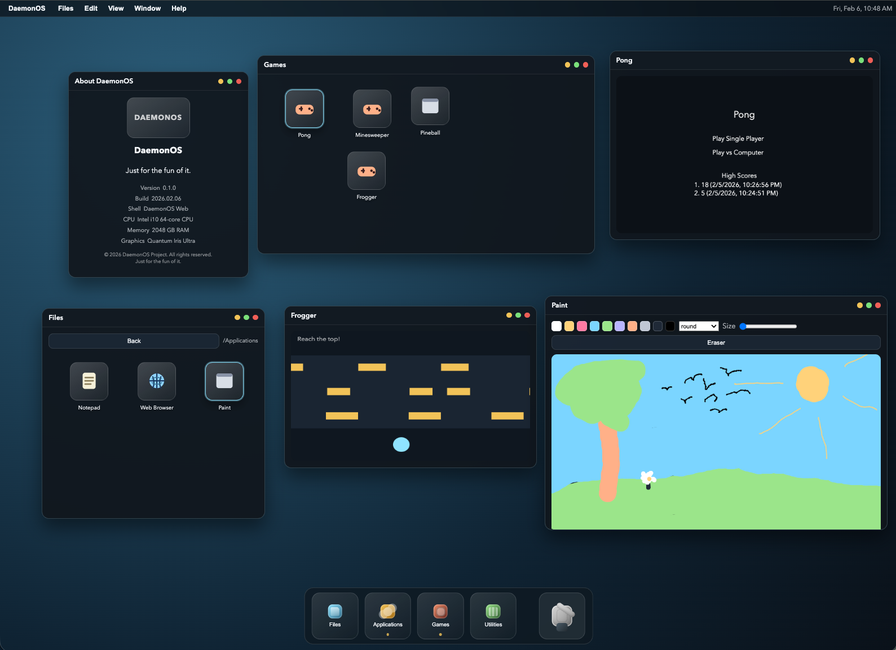

# DaemonOS

DaemonOS is a playful, browser‑based “operating system” interface. It’s built as a fun experiment in UI/UX, app modularity, and safe client‑side execution. There is no server‑side code and no interpreted user input — everything runs locally in the user’s browser.



## Purpose
- A creative playground for desktop‑style UI experiments
- A lightweight app shell for browser‑native “apps”
- A static, client‑only deployment that minimizes attack surface

## Highlights
- **Games**: Pong, Minesweeper, Frogger, Pineball (Planck.js), Racecar, Chess, Checkers, Connect 4, Snake, Asteroids, Space Invaders, Spacefighter.
- **Music Player**: Winamp‑inspired playback with playlists and multiple visualizer modes.
- **Screensavers**: Starfield, Aurora Lines, Matrix code rain, and Flying Toasters.
- **Desktop OS UX**: dock with tray launchers, menu bar with volume + fullscreen, window management, and theming.

## Architecture (High‑Level)
- **Static front‑end** served by Nginx (containerized)
- **OS shell** in `site/os.js` manages windows, dock, menus, settings, and app loading
- **Apps** are modular JS entrypoints defined in `site/apps/registry.json`
- **Lazy loading** uses dynamic `import()` so apps load only when opened

Key directories:
- `site/index.html` — shell UI and CSP
- `site/styles.css` — visual system
- `site/os.js` — runtime, window manager, menus
- `site/apps/registry.json` — app registry
- `site/apps/**` — app entrypoints

## Security Model
DaemonOS is intentionally conservative:
- **Client‑side only**: no backend execution, no server‑side rendering, no proxying
- **Strict CSP** in `site/index.html` to limit script origins
- **No eval / interpreted user input** in core app system
- **Iframe sandbox** for the browser app (local pages only; external links open in new tabs)
- **Read‑only container** with dropped Linux capabilities
- **No privileged operations**; Nginx runs with restricted permissions

These controls keep the attack surface small while still enabling a rich UI.

## Running
From the repo root:

```sh
docker compose up
```

By default the container serves `./site`.

## Custom Apps
Add apps by:
1. Creating an entrypoint under `site/apps/<category>/<app>/<app>.js`
2. Registering it in `site/apps/registry.json`

Apps should export `createApp(osAPI)` and return a window payload:

```js
export function createApp(osAPI) {
  return {
    title: "My App",
    width: 500,
    height: 350,
    content: document.createElement("div"),
  };
}
```

## Screensavers & Media
- Screensaver behavior is configurable in **Settings** (enable, timeout, style).
- Global volume control in the menu bar affects all app audio.
- Music playlists are defined by `site/media/music/playlist.json`.

## Notes
This is a hobby project and an experiment. Expect rapid iteration, playful UI changes, and occasional breaking changes.
